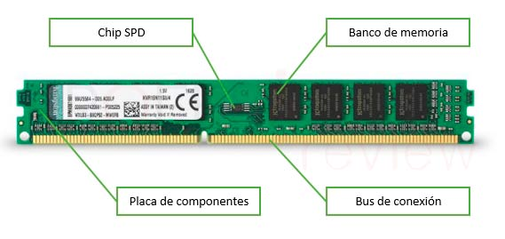

# Hardware 
## CPU 
Según la pagina oficial de intel, el "central processor unit" (CPU por sus siglas en inglés) es el componente encargado de ejecutar los comandos y procesos necesarios para que un computador funcione. Compuesta de millones de transistores que a su vez están agrupados (más que todo en las unidades mas modernas) en núcleos, cuya potencia, dependiendo de la ingeniería de la unidad, puede ser aprovechada individualmente por nucleo, o puede ser dividida en 2 o más "hilos", que son en resumen los subprocesos (o tareas) que realiza un solo nucleo en simultaneo. 
["Cpu vs. Gpu: What's the difference"; Página oficial de Intel.](https://www.intel.com/content/www/us/en/products/docs/processors/cpu-vs-gpu.html)
["Nucleos e hilos en un procesador: que son y en que se diferencian";  Diario EL ESPAÑOL, 2017.](https://www.elespanol.com/omicrono/tecnologia/20170707/nucleos-hilos-procesador-diferencian/229478224_0.html)
## GPU
La gpu es un tipo de procesador que esta compuesto por una cantidad mayor de nucleos más pequeños, en comparación con la cpu, que trabajan en conjunto para ofrecer una mayor potencia multinucleo. Casi siempre son mucho mas eficientes a la hora de manejar unos tipos especificos de tareas que requieren de una mayor cantidad de nucleos de menor potencia, siendo un ejemplo común el manejo de procesos gráficos, como tareas de diseño en 3d o procesamiento de gráficos de videojuegos. 
["Cpu vs. Gpu: What's the difference"; Página oficial de Intel.](https://www.intel.com/content/www/us/en/products/docs/processors/cpu-vs-gpu.html) 
## Motherboard
Se trata de una placa de circuito impreso responzable de la comunicación de los otros componentes de hardware. Sus componentes son variados y su calidad depende del fabricante. Usualmente estan compuestas por: conectores de alimentación y datos, condensadores, disipadores de calor y ventiladores, entre muchos otros. 
["¿Qué hace la tarjeta madre?"; Página oficial de HP, 2021.](https://www.hp.com/co-es/shop/tech-takes/que-hace-la-tarjeta-madre) 
## Memoria RAM 
La memoria RAM o "Random Acces Memory" por sus siglas en inglés, es la encargada de dar un espacio a los programas para acceder de forma inmediata a archivos y datos de corto plazo o temporales. Su funcionamiento depende de su arquitectura e ingeniería, y del programa o de los programas que se estén usando en el momento. Una analogía muy util para describir su funcionamiento es la del escritorio, en su escritorio usted puede hacer varias tareas teniendo el material necesario a la mano.
["¿Que hace la memoria de la computadora (RAM)?"; Página oficial de Crucial México.](https://www.crucial.mx/articles/about-memory/support-what-does-computer-memory-do#:~:text=La%20RAM%20le%20permite%20que,de%20cada%20tarea%20se%20encuentra.)
 
## Almacenamiento 
Hay diferentes tipos de almacenamiento. Las unidades de estado sólido (SSD) y las unidades de disco duro (HDD) son dispositivos de almacenamiento de datos. Las SSD almacenan datos en la memoria flash, que comprende diversos circuitos integrados para almacenar y recuperar datos, mientras que las HDD almacenan datos en discos magnéticos, y tienen varias piezas mecánicas que se mueven juntas para almacenar y recuperar datos. La diferencia más notable, a parte de su arquitectura, es la velocidad de escritura y lectura que manejan, siendo los ssd mucho mas eficientes, y por su complejidad suelen ser más costosos. 
["SSD y HDD: diferencias entre dispositivos de Almacenamiento"; Amazon Web Services](https://aws.amazon.com/es/compare/the-difference-between-ssd-hard-drive/)

## Adicionales
No seré muy especifico en este apartado, está dado que no quiero hacer la alclaración de que no todos los equipos estan compuestos de igual forma, por ejemplo, un computador de escritorio usa una unidad de potencia asemejada a una caja para brindar la energía necesaria al equipo, mientras que un computador portatil utiliza diferentes sistemas para proporcionar esta energía (como una batería y una fuente externa de alimentación).
# Software
## Sistema operativo
Un sistema operativo es un espacio encargado de gestionar los recursos, datos y archivos de un ordenador, y usualmente están diseñados para ser amigables con el usuario promedio (sin embargo hay sistemas operativos muy complejos de usar, como algunos basados en Linux)
["Tipos de sistemas operativos y sus características"; Universitat Carlemany, 2022.](https://www.universitatcarlemany.com/actualidad/blog/tipos-de-sistemas-operativos/)
## Drivers
Un controlador o "Driver" es un componente de software que se encarga de comunicar un dispositivo fisico con el sistema operativo de un ordenador
["¿Qué es un controlador?"; Página oficial de Learn Microsoft, 2023](https://learn.microsoft.com/es-es/windows-hardware/drivers/gettingstarted/what-is-a-driver-)
 
## Adicionales
Así como en el primer apartado, la cantidad de programas y elementos de software que se pueden mencionar son infinitos. Pueden ser programas de desarrollo, motores "visuales", básicamente cualquier conjunto de programas que haya sido desarrollado con una función especifica (o incluso sin una), hace parte de lo que se puede llamar software.
# Mapa Mental

# Preguntas
¿Cuál es la función principal de cada componente investigado? - Respondido en los apartados anteriores

¿Cómo interactúa el hardware con el software, cuál es la función de cada uno? - Por medio de los Drivers, comunican los dispositivos fisicos con el sistema operativo

¿Cuál es la función de la CPU y cuáles son sus partes más importantes? - Respondida en el primer apartado

¿Qué es la velocidad de la CPU, también conocida como velocidad del reloj? - La velocidad reloj mide la cantidad de procesos que hace el CPU en GHz (Gigahertz)

¿Cuál es la secuencia de pasos que ocurre, desde el momento en que presionas el botón de encendido de la computadora, hasta que se muestra el sistema operativo listo para funcionar? Describe todos los elementos involucrados y el paso a paso. - Estos procesos son muy extensos, pero en general sigue los siguientes pasos: inicialización de la fuente de alimentación, inicialización del procesador, arranque de la placa base, comprobación de la memoria RAM, arranque de todos los buses primarios y secundarios, arranque de la tarjeta gráfica,

monitorización de las unidades de almacenamiento, comprobación de las tarjetas de expansión, se inicia la GUI de la BIOS/UEFI de la placa base, carga del sistema operativo.
[Vease "¿Qué pasa en tu PC cuando pulsas el botón de encender?", foro HZ hard zone, 2024](https://hardzone.es/tutoriales/montaje/arrancar-ordenador/)

Comenta algo que no sabías y que descubriste en esta actividad:
Realmente para empezar no tenía conocimiento algúno de visual studio code, markdown y demás temas que vimos las primeras 3 clases. Luego profundicé un poco en lo que ya había visto respecto a como funciona un compurador y sus componentes individuales. 