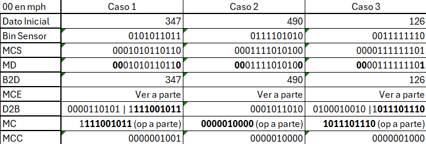
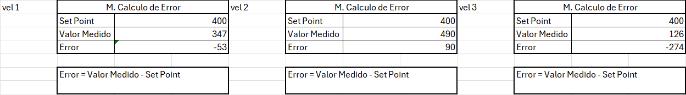
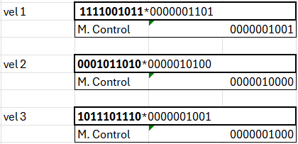

# Actividad 1. Casos aplicados.

## Donde:
Mcs: Módulo de codificación de sensores

Md: Módulo de Decodificación

B2D: Módulo de conversion Bin2Dec

MCE: Módulo de cálculo de errores

D2B: Módulo de conversion Dec2Bin

MC: Módulo de Control

MCC: Módulo de codificación de la CPU

Bit de pariedad par al final

Velocidad 00
Altitud 01
Temperatura 11

## Caso 1 Velocidad

Con las operaciones del MCE:

Y las operaciones del MC

## Caso 2 Altitud

## Caso 3 Temperatura
