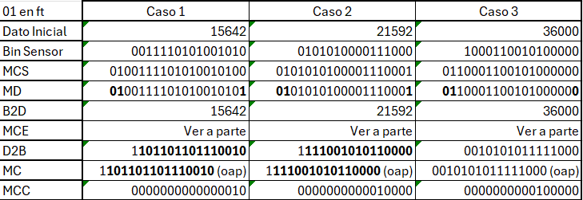
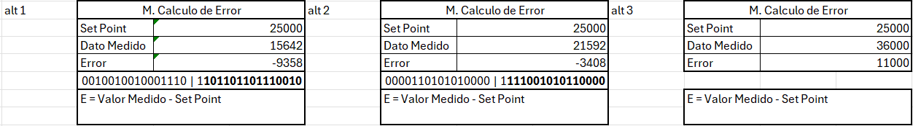
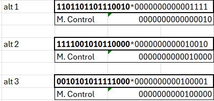
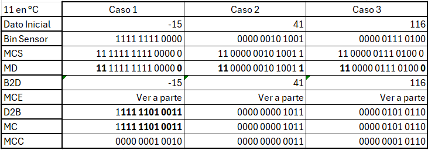
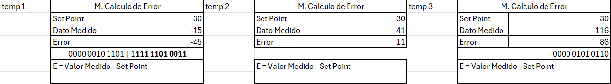
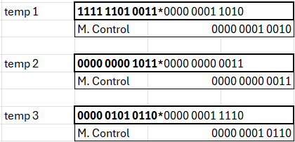

# Actividad 1. Casos aplicados.

## Donde:
Mcs: Módulo de codificación de sensores

Md: Módulo de Decodificación

B2D: Módulo de conversion Bin2Dec

MCE: Módulo de cálculo de errores

D2B: Módulo de conversion Dec2Bin

MC: Módulo de Control

MCC: Módulo de codificación de la CPU

Bit de pariedad par al final

Velocidad 00
Altitud 01
Temperatura 11

## Diagrama de bloques

## Velocidad

Con las operaciones del MCE:

Y las operaciones del MC

## Altitud

Con sus respectivas operaciones del MCE:

Y las operaciones del módulo MC:

## Temperatura

Operaciones del MCE:

Y las operaciones del MC:

## Conclusiones
Si bien estaba enterado de este sistema numerico, nunca me había puesto con detenimiento a analizarlo o si quiera a intentar entenderlo. Este sistema permitió la virtualización de muchas tareras de la vida cotidiana.

Es simplemente increíble todo lo que se ha logrado en el ambito de la computación unicamente con estos dos dígitos. Me permitió saber como puedo armar un sistema básico, como plantearlo y como funcionan los modulos que lo componen. 

Ahora conozco de donde salen los terminos que usualmente se usan en las nomenclaturas de los equipos que utilizamos diariamente  en nuestros ámbitos educativos y/o laborales.